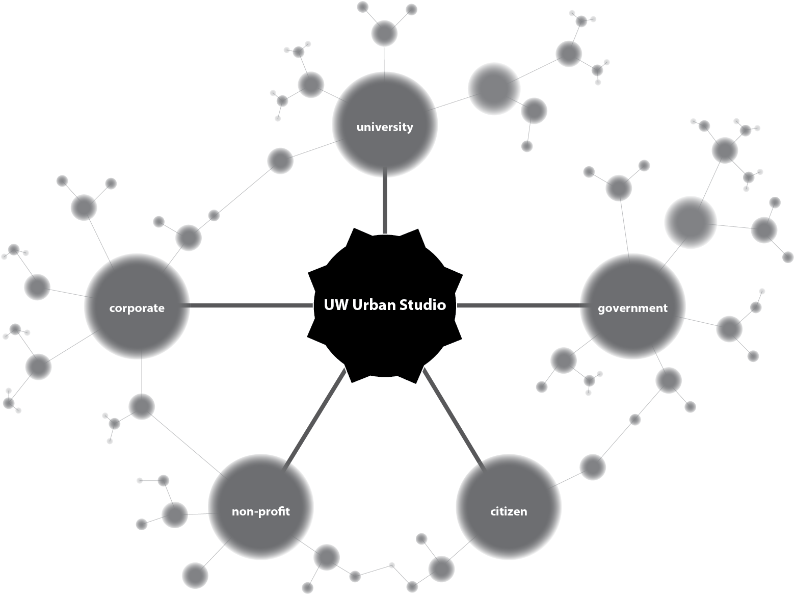
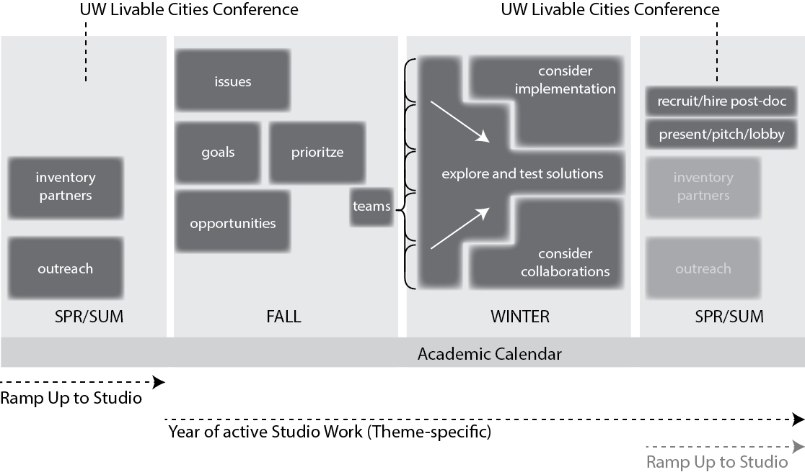

#Livable Cities UW#
For more on Livable Cities read the [initial draft of the Livable Cities Idea](https://github.com/vargovargo/LivableCities/blob/master/LivableCitiesOriginal.md#livable-cities-inspiring-the-university-to-create-future-ready-communities) and the [Introduction of the Studio Concept](https://github.com/vargovargo/LivableCities/blob/master/StudioIntro.md#livable-cities-uw).

- - -

 
##Vision##
Our goal is make the University of Wisconsin an international destination for science, scholarship and outreach to create diverse, safe, healthy and just urban areas. With concepts and prototypes for cleaner air, water, soil and power, and economically, equitably, ecologically and culturally rich urban places, we want to offer practical systems and models that emerging cities around the world can adapt and adopt.

##The UW Urban Studio##
###University Rigor. Real Problems. Better Places. Fuller Lives.###
Universtiy of Wisconsin Livable Cities, through its ___Urban Studios___, aims to connect UW experts and students with local governments and communities around the places we live. Our goal is to produce solutions that serve as models for improving lives in for people in cities around the world.  

Cities are now the dominant human habitat on Earth. Activities within their administrative boundaries affect places and people far beyond.  Thus urban innovation and solutions are needed to solve problems at the scale of local inequalities and global climate change. Impactful research and meaningful training require universities to work with cities, however, there is currently no good mechanism for directing the incredible faculty and student resources of the UW to study and work on these issues.  ___UW's Urban Studio___ will be a physical University space in the City of Madison where the _sectors_ of urban life convene. The Stuido is both a forum for stakeholders to collectively define urban issues and an incubator for creating solutions.

The five sectors and their expected outcomes are:

>__Citizen__

>_improved quality of life, health, opportunity, security_

>__Corporate__

>_discovery of new products, services, and markets_

>__Government__

>_improved policies and partnerships with citizens and businesses_

>__Service (non-profit)__

>_improved tools and designs for new programs and partnering communities_

>__University__

>_new research fronteirs and collaborations on and off campus_

##Project Plan##
To foster the collaborations we see as needed for urban innovation and success Studios are designed to focus attention on specific issues around UW has momentum. Importantly, however, the 5 year plan for Studios includes rolling out new themes in Studios. This helps ensure that the connections between urban systems investigated in any one Studio are considered within the context of 

The Urban Studio will be conducted on annual basis with changing themes determined by the UW Livable Cities Coordinating Council. Each year the studio would concentrate on a theme of urban activity. Already, several themes have been identified for the first five (_5_) years of operation.

+ [Local Motion -- Active Transport in Cities](StudioIntro.md#local-motion--active-transport-in-cities)
+ [Weather Ready Cities](StudioIntro.md#weather-ready-cities)
+ [Feeding the City](StudioIntro.md#feeding-the-city)
+ [Energy Independent Cities](StudioIntro.md#energy-independent-cities)
+ 

In addition to the Studios, each year a conference will be held in Madison, WI on urban issues and research. The conference serves three purposes

1. Introduces the studio theme for the coming year and engages the participating parties from the 5 sectors.
2. Connects the results and progress from the previous Studio's work to new Studios and the public through presentation and discussion 
3. Increases the visibility of UW and the City of Madison in the arena of urban sustainability research and practice

##Activities / Operations##

The Studio will serve as a space for hosting stakeholders, fostering discussion, prototyping designs and solutions, and presenting ideas to the public. Each Theme will inhabit the Urban Studio space for approximately one year, however,  activities and partnerships formed through that work are expected to continue beyond the first year. Annually a new network of related UW faculty and non-University partner ogranizations will be assembled based on the Studio Theme. Associated faculty will recieve 20% time buy out for participation and be expected to work out of the Studio space part time during that year. ___Student recruitment for Studio participation is still a hurdle (NEED MORE HERE).___ The operation of the Urban Studio will be handled by a new administrative manager, and staffed by two (_2_) student hourlies/term. Additionally, following each Theme (ie each year) faculty members of the Studio will recruit a post-doc to be hired.

The five year plan for the Studios builds in 

The Urban Studio requies an annual budget of approximately $250,000. This goes toward:

+  

